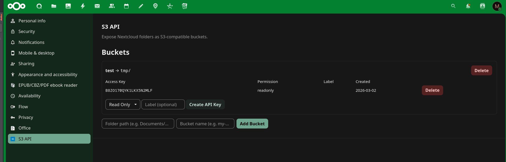

<div align="center">

# 🪣 S3 API for Nextcloud

**Point any S3 client at a folder you already have.**

*No object store · No duplication · Your files stay files*

[](https://nextcloud.com)
[](https://www.gnu.org/licenses/agpl-3.0)
[](https://www.php.net)

<br>



</div>

---

## What it does

Mark any Nextcloud folder as a bucket, create an API key, point `aws s3` at it. That's the whole
idea.

The files stay **ordinary Nextcloud files** — visible in the web UI, synced by the desktop client,
shareable, versioned, backed up along with everything else. There is no second copy in an object
store and no import step. A file a colleague drops into the shared folder is an object your script
can `GET` a second later.

```bash
aws s3 cp backup.tar.zst s3://my-bucket/ \
  --endpoint-url https://cloud.example.com/apps/s3_api/s3
```

---

## ✨ Why this one is different

Most "S3 for X" bridges implement the four calls a file sync needs and stop there. This one
implements the parts that let a real tool use it as a backend:

<table>
<tr><td width="50%" valign="top">

### 🔒 Conditional writes that actually hold
`If-Match` / `If-None-Match` with **serialised concurrent writers**, so exactly one of a set of
racing writes wins. That makes the store usable as a compare-and-swap primitive, not just a
key-value dump.

</td><td width="50%" valign="top">

### 🧩 Multipart, including compose
Create, upload, copy parts, complete, abort, list. `UploadPartCopy` gives you server-side compose —
stitching objects together without a round trip through the client.

</td></tr>
<tr><td valign="top">

### 📐 Correct ETags
Content MD5 for single-part, the compound `<md5-of-part-md5s>-<parts>` form for multipart.
Deliberately **not** Nextcloud's internal etag — see below for why that one is dangerous.

</td><td valign="top">

### 🌊 Real streaming
Bodies are decoded and written as a stream, never buffered in memory. `aws-chunked` payloads have
their **per-chunk signature chain verified**, which is what binds the uploaded bytes to the
credential.

</td></tr>
</table>

Plus ranged reads, conditional reads, delimited listings, presigned URLs and batch deletes.

> ⚠️ **Throughput.** Every request goes through PHP and Nextcloud's storage layer. This is a
> convenient way to talk S3 to data you already keep in Nextcloud — not a replacement for a real
> object store in front of a large workload.

---

## 🚀 Quick start

```bash
cp -r s3_api /var/www/nextcloud/apps/
sudo -u www-data php occ app:enable s3_api
```

Then in Nextcloud: **Settings → Personal → S3 API** → register a folder as a bucket → create an
API key. Note down both keys; the secret is shown once.

<details>
<summary><b>Requirements and update notes</b></summary>

<br>

* Nextcloud 30–34, PHP 8.1+
* **Nextcloud's cron must run** — abandoned multipart uploads are only reclaimed by a background
  job
* `app:enable` runs the migrations. `occ upgrade` is for core upgrades and will not touch an app.
  To update after bumping the version: `occ app:disable s3_api && occ app:enable s3_api`

</details>

---

## 🔧 Connecting a client

**Endpoint:** `https://<nextcloud-host>/apps/s3_api/s3`

Only **path-style** addressing works (`<endpoint>/<bucket>/<key>`) — a Nextcloud instance cannot
serve per-bucket subdomains. Most clients need to be told this explicitly.

> **Trailing slash:** some SDKs (notably `aws-sdk-rust`) append the bucket to the endpoint without
> a separator, turning `…/s3` into `…/s3my-bucket` and 404ing on every request. If your client
> does no path normalisation, configure `https://<host>/apps/s3_api/s3/`. The AWS CLI and boto3
> accept either form.

### AWS CLI

```ini
# ~/.aws/credentials
[nextcloud]
aws_access_key_id     = <access-key>
aws_secret_access_key = <secret-key>
```

```bash
aws s3 ls s3://my-bucket \
  --endpoint-url https://<nextcloud-host>/apps/s3_api/s3 \
  --region us-east-1
```

### boto3

```python
import boto3
from botocore.config import Config

s3 = boto3.client(
    "s3",
    endpoint_url="https://<nextcloud-host>/apps/s3_api/s3",
    aws_access_key_id="<access-key>",
    aws_secret_access_key="<secret-key>",
    region_name="us-east-1",
    config=Config(signature_version="s3v4", s3={"addressing_style": "path"}),
)

s3.upload_file("file.txt", "my-bucket", "file.txt")
```

---

## 📦 Using it as a walgit store

[walgit](https://github.com/tobi/walgit) keeps git history in an object store and uses conditional
writes on `manifest.pb` as its commit point. That exercises considerably more of the S3 API than a
file sync does: compare-and-swap, conditional and ranged reads, presigned URLs, delimited
listings, server-side copy.

**walgit's backend contract suite passes against this app.**

<details>
<summary><b>walgit.toml</b></summary>

<br>

```toml
[store]
backend = "s3"
bucket = "gittest"              # the bucket name registered in Nextcloud
prefix = ""                     # optional key prefix inside the bucket
max_retries = 8

# Nextcloud is not a high-throughput object store and every part is buffered
# server-side, so keep parts modest rather than the 64/32 MiB defaults.
multipart_threshold = "32MiB"
multipart_part_size = "8MiB"

[store.s3]
# Note the trailing slash: aws-sdk-rust does not add a separator before the
# bucket name.
endpoint = "https://<nextcloud-host>/apps/s3_api/s3/"
region = "us-east-1"
access_key_env = "AWS_ACCESS_KEY_ID"
secret_key_env = "AWS_SECRET_ACCESS_KEY"
force_path_style = true         # required: no per-bucket subdomains

[server]
listen = "127.0.0.1:8080"

[cache]
dir = "/var/lib/walgit"

[bundles]
# Bundle URIs are composed in the bucket with UploadPartCopy, which works, but
# the bytes still pass through the Nextcloud PHP process. Serve them by proxy
# rather than handing clients presigned URLs.
serve_via = "proxy"

[lfs]
serve_via = "proxy"
```

Credentials come from the environment, not the config file:

```bash
export AWS_ACCESS_KEY_ID=<access-key>
export AWS_SECRET_ACCESS_KEY=<secret-key>
walgit serve --config walgit.toml
```

The API key needs `readwrite` — walgit writes on every push and takes leases during maintenance.

</details>

<details>
<summary><b>Verifying it yourself</b></summary>

<br>

walgit's store contract suite runs against any endpoint:

```bash
git clone https://github.com/tobi/walgit && cd walgit
WALGIT_TEST_S3_ENDPOINT=https://<nextcloud-host>/apps/s3_api/s3/ \
WALGIT_TEST_BUCKET=<bucket> \
AWS_ACCESS_KEY_ID=<access-key> \
AWS_SECRET_ACCESS_KEY=<secret-key> \
  cargo test -p walgit-store --test contract s3_contract
```

It covers conditional create/update under 32-way concurrency, conditional and ranged reads,
delimited listings, an 8 MiB streamed round trip verified by digest, multipart uploads and
server-side compose.

For an end-to-end check with real git, `bin/README.md` has build instructions for a `walgit`
binary. Pushing a 2000-commit repository, cloning it back into an empty cache and running
`git fsck --strict` exercises the whole path — that is where this object layout comes from:

```
repos/<owner>/<repo>/manifest.pb      # the CAS commit point
repos/<owner>/<repo>/log/*.pb         # WAL entries
repos/<owner>/<repo>/wal/*.pack       # packfiles
repos/<owner>/<repo>/wal/*.idx        # …plus .rev, .bitmap, .commit-graph
```

</details>

**Caveats for this use case:** single-shot uploads are bounded by `post_max_size`,
`upload_max_filesize` and the web server's body limit (nginx `client_max_body_size`) — multipart
sidesteps this, which is why the threshold above is lowered. And cron has to run, or abandoned
uploads are never reclaimed.

---

## 📋 Supported operations

| Operation                | Method | Notes                                                     |
|--------------------------|--------|-----------------------------------------------------------|
| ListBuckets              | GET    | reports only the bucket the key is scoped to              |
| HeadBucket               | HEAD   |                                                           |
| GetBucketLocation        | GET    | `?location`, always `us-east-1`                           |
| GetBucketVersioning      | GET    | `?versioning`, always unversioned                         |
| ListObjects (v1)         | GET    | `prefix`, `delimiter`, `marker`, `max-keys`               |
| ListObjects (v2)         | GET    | plus `start-after`, `continuation-token`                  |
| GetObject                | GET    | `Range`, `If-Match`, `If-None-Match`                      |
| HeadObject               | HEAD   |                                                           |
| PutObject                | PUT    | `If-Match`, `If-None-Match`, `aws-chunked` bodies         |
| CopyObject               | PUT    | `x-amz-copy-source`, same bucket only                     |
| DeleteObject             | DELETE |                                                           |
| DeleteObjects            | POST   | `?delete`                                                 |
| CreateMultipartUpload    | POST   | `?uploads`                                                |
| UploadPart               | PUT    | `?uploadId&partNumber`                                    |
| UploadPartCopy           | PUT    | plus `x-amz-copy-source-range`                            |
| CompleteMultipartUpload  | POST   | `?uploadId`                                               |
| AbortMultipartUpload     | DELETE | `?uploadId`                                               |
| ListParts                | GET    | `?uploadId`                                               |
| ListMultipartUploads     | GET    | `?uploads`                                                |

Any other subresource (`?acl`, `?tagging`, `?lifecycle`, …) answers `NotImplemented` rather than
being ignored — an ignored subresource would otherwise be handled as an operation on the object
itself.

---

## 🧠 Semantics worth knowing

<details open>
<summary><b>Why not Nextcloud's own etag</b></summary>

<br>

Nextcloud's etag is `md5(mtime + inode + dev + size)`. Because mtime has one-second resolution,
**two writes of equally sized but different content within the same second share an etag** — more
than enough for a compare-and-swap to accept a lost update.

This app therefore computes S3 ETags from content: plain MD5 for single-part uploads, the compound
`<md5-of-part-md5s>-<parts>` form for multipart. Objects written outside this API (web UI, WebDAV,
sync client) get an ETag on first read.

</details>

* **Conditional writes** return `412 PreconditionFailed`. `If-None-Match: *` is create-only,
  `If-Match: <etag>` replaces exactly that version. Concurrent conditional writes to one key are
  serialised, so exactly one of a set of racing creates or updates succeeds.
* **Streaming.** Uploads are not held in memory. `Content-Encoding: aws-chunked` with a trailing
  checksum — the default for current AWS SDKs — is decoded rather than stored verbatim. Where the
  client signs each chunk (`STREAMING-AWS4-HMAC-SHA256-PAYLOAD`) the signature chain is verified,
  which is what ties the uploaded bytes to the credential: with that payload type, SigV4 itself
  covers only the headers.
* **Multipart parts** live in a hidden `.s3-uploads/` folder inside the bucket while an upload is
  in flight, excluded from listings. Uploads never completed or aborted are reclaimed after a week
  by a background job.
* **Keys map to paths.** A key containing `/` creates folders, so `a/b` and `a` cannot both be
  objects.

---

## 🔐 Authentication

**AWS Signature V4**, either via the `Authorization` header or as a presigned URL
(`X-Amz-Signature` in the query string). Requests older than 15 minutes are rejected, as are
expired presigned URLs; `X-Amz-Expires` is capped at seven days, as on AWS.

Each API key is bound to **exactly one bucket** and is either `readonly` or `readwrite`.
`ListBuckets` reports only that bucket — not every bucket the owning account happens to have.

---

## 🛠️ Development

<details>
<summary><b>Publishing a release to the Nextcloud App Store</b></summary>

<br>

```bash
./build-release.sh --no-sign   # or without the flag once you have a certificate
```

GitHub's own release tarballs are *not* usable: they put the version into the top level folder
name, while the store requires that folder to be exactly the app id. The script builds a
conforming archive and verifies the layout.

**One-time setup:**

1. Generate a key and CSR — the CN **must** be the app id, `s3_api`:
   ```bash
   mkdir -p ~/.nextcloud/certificates && cd ~/.nextcloud/certificates
   openssl req -nodes -newkey rsa:4096 -keyout s3_api.key -out s3_api.csr -subj "/CN=s3_api"
   ```
2. Open a PR with `s3_api.csr` against
   [nextcloud/app-certificate-requests](https://github.com/nextcloud/app-certificate-requests).
   They sign it and post `s3_api.crt` back — save it next to the key.
3. Register the app id at [apps.nextcloud.com/developer/apps/new](https://apps.nextcloud.com/developer/apps/new)
   with the certificate and this signature:
   ```bash
   echo -n "s3_api" | openssl dgst -sha512 -sign ~/.nextcloud/certificates/s3_api.key | openssl base64
   ```

**Per release:** bump `<version>` in `s3_api/appinfo/info.xml`, add a matching `## X.Y.Z` section
to `CHANGELOG.md` (the script refuses to build if they disagree — a mismatch makes the store
import an empty changelog), tag, attach the tarball to a GitHub release, then submit the URL plus
the printed signature at
[developer/apps/releases/new](https://apps.nextcloud.com/developer/apps/releases/new).

> Keep `s3_api.key` private. Losing it means revoking the certificate, and re-registering deletes
> every existing release.

</details>

---

<div align="center">

**AGPL-3.0-or-later**

</div>
